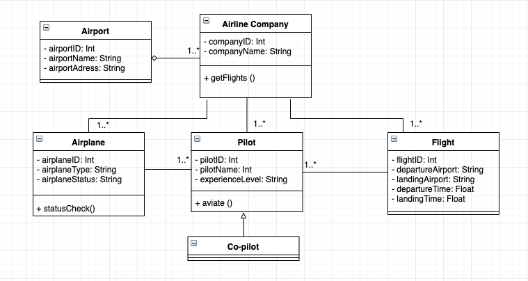

# Flight Management Diagram

**Uçuşların ve pilotların yönetimi için bir sistem tasarlayın.**

- Hava yolu şirketleri uçuşları gerçekleştirir. Her hava yolunun bir kimliği vardır.
- Hava yolu şirketi, farklı tipteki uçaklara sahiptir.
Uçaklar çalışır veya onarım durumunda olabilir.
- Her uçuşun benzersiz kimliği, kalkacağı ve ineceği havaalanı, kalkış ve iniş saatleri vardır.
- Her uçuşun bir pilotu ve yardımcı pilotu vardır ve uçağı kullanırlar.
Havaalanlarının benzersiz kimlikleri ve isimleri vardır.
- Hava yolu şirketlerinin pilotları vardır ve her pilotun bir deneyim seviyesi mevcuttur.
Bir uçak tipi, belirli sayıda pilota ihtiyaç duyabilir.
  
Bu sistemi tasvir eden Class(Sınıf) diyagramını çiziniz.
  
**Diagram**

  
Bu proje [Patika.dev](https://www.patika.dev/tr) eğitimi kapsamında yapılmıştır.