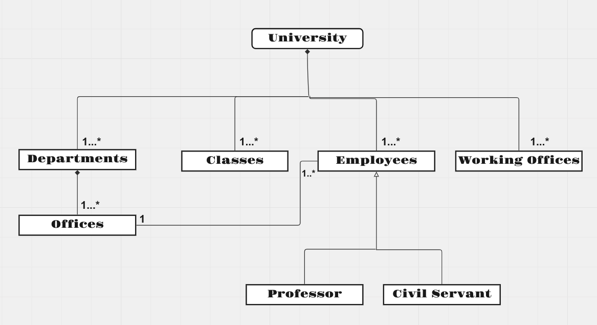

# University Management Diagram

**Bu sistemi tasvir eden Class (Sınıf) diyagramını çiziniz.**

1 - Üniversiteye ait sınıflıklar, çalışma ofisleri ve departmanlar vardır.

2 - Departmanlara ait ofisler vardır.

3 - Üniversiteye ait çalışanlar vardır. Bu çalışanlar profesör veya memur olabilir.

4 - Her çalışan bir ofiste çalışır.

Not : Sınıflara ait nitelik ve davranışların belirtilmesine gerek yoktur.

  
**Diagram**

  
Bu proje [Patika.dev](https://www.patika.dev/tr) eğitimi kapsamında yapılmıştır.